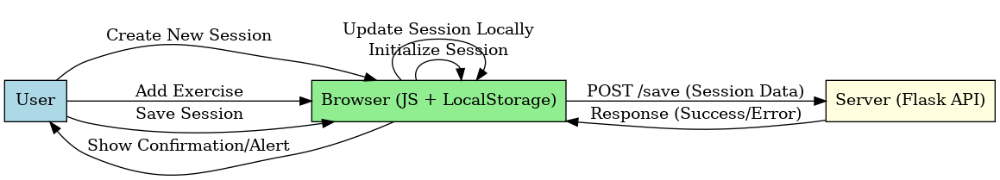
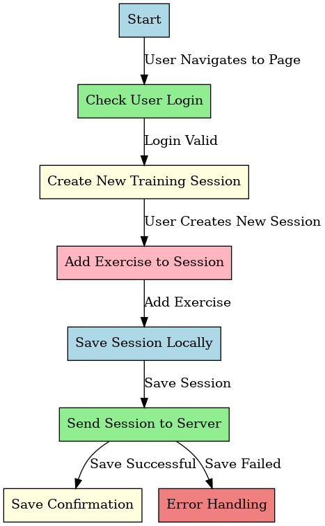
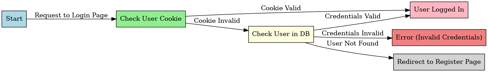

# Design 

## Architecture 
### Front-End:
#### HTML, CSS, and JavaScript:

 The front-end aspect of the Sixpack application leverages basic web technologies. HTML structures the content of each page, while CSS styles the interface with a clean design, ensuring a responsive layout for different screen sizes. JavaScript handles user interactions, such as dynamically loading and modifying training sessions, validating forms, and responding to events triggered by users. This process can be visualized in the **flowchart diagram**, that shows the logical progression from the user action to local and server-side updates 

### Back-End
#### Flask:
Given its modularity and simplicity, it has been decided to use Flask as a back-end tool that guarantees the possibility to add new  functions and to perform actions by using a given interface. Flask routes are used to manage different endpoints, handle login and registration processes, and facilitate interactions between the client and server. The **sequence diagram** illustrates the interaction between the user, the front-end browser logic, and the Flask server during the creation of a new training session and adding an exercise, emphasizing the flow of data between client and server. 

### Data Management
#### Local Storage and Server Communication:
The project incorporates JavaScript's local storage for temporarily saving user data and loading it when is requested. Additionally, server communication is handled via fetch API calls that interact with the Flask back-end, allowing data persistence and updates to be saved on the server. The client-server interaction for data persistence is depicted in the Sequence Diagram, which shows how data is saved locally and then sent to the server via fetch API calls.

## Interaction
### Create a new trainig session
After the registration and the login, the users are redirected to the homepage. 
Here they have the possibility to manage existing workouts or create a new one.
The **Flowchart Diagram** shown below, maps the logical flow from session creation to saving it locally and on the server.

### Add an exercise
User: Once that the users have created or retrieved a past training session, they can modify the exercises or add a new exercises by clicking the "+" button and a ready-to-use grid will appear.
The spaces of the grid need to be filled out with the name of the exercise, the number of reps, the number of series, the time break and a link to whatever the users want (images or videos).
The process is detailed in the **Sequence Diagram**, showing steps from user input to saving the session.

## Behaviour
### Flowchart diagram
The diagram included earlier provides a high-level overview of the app's behavior:
1. **Start:** The app initializes with no training sessions.
2. **Training Session Creation:** The user creates their first session.
3. **Modification of Sessions:** Users can add or remove exercises from sessions.
4. **Modification of Exercises:** Individual exercises within a session can be edited.

## Domain-driven Design (DDD)
The Sixpack application is centered around the domain of managing workout sessions. It's primary goal is to help fitness enthusiast to create and manage their workouts. Here’s a brief breakdown based on Domain-Driven Design (DDD) principles:

### Domain
The domain of the Sixpack application revolves around managing user workout sessions, emphasizing the creation, modification, and persistence of training data. The target audience of the application are athletes, fitness lovers, bodybuilders and similars.

### Core Entities and Aggregates
1. **User:** This class represents the person who wants to start using Six-pack. A user has a *name*, an *e-mail* and a *password*. User details are stored in the memory to authenticate and manage user-specific training sessions. A user aggregates heir associated training sessions and exercises.
2. **Exercise:** This class stands for a physical activity that a user wants to do during a training session. It can be repeated multiple times both consequently or after a short break.
An exercise has an idenrifier (*exercise_id*), a *name* number of *reps*, number of *series*, time break (*rest_time*), a body part that is supposed to train (*target_body_part*) and eventually a link (*media_link*) to a video or an image if the user wants to add it.
3. **Training session:** Consists of a collection of exercises grouped under a session title (*session_id*). Each training session is linked to a user (*user_id*), allowing them to customize and manage their personal workout routines, and has a name (*title*). The training session is divided by days of the week. The user can create a workout routine for each *day* of the week. The exercise entity represents a single physical activity within a training session.

### Domain Events
Key domain events include:
1. **UsereRegistered:** Triggered when a new user successfully registers.
2. **TrainingSessionCreated:** Triggered when a user creates a new training session.
3. **ExerciseAdded:** Triggered when an exercise is added to a training session.
4. **TrainingSessionUpdated:** Triggered when modifications are made to a training session or its exercises.
5. **TrainingSessionDeleted:** Triggered when a training session is removed.

### Commands
Commands represent explicit instructions for performing operations within the system. Examples include:
1. **RegisterUser:** A new User entity is created, and the UserRegistered event is triggered.
2. **CreateTrainingSession:** A new TrainingSession entity is created under the user's aggregate, and the TrainingSessionCreated event is triggered.
3. **AddExercise:**  A new Exercise entity is added to the corresponding TrainingSession aggregate, and the ExerciseAdded event is triggered.
4. **UpdateTrainingSession:** The TrainingSession entity is updated, and the TrainingSessionUpdated event is triggered.
5. **DeleteTrainingSession:** The TrainingSession entity is deleted, and the TrainingSessionDeleted event is triggered.

### State diagram
The Login State Diagram explains the authentication flow, showing how user actions transition through states such as cookie validation, database checks, and error handling

## Data-related aspects
1. **User table:** Containing all the users'data 
2. **Training session table:** Containing all the training sessions created by a single user
3. +*Exercise table:** Containing all the exercises inserted in the various training session by the user.
4. Data Persistence:** Data is temporarily stored in the client’s local storage for seamless transitions between pages and is persisted to the server database using JavaScript’s fetch API with POST requests.

